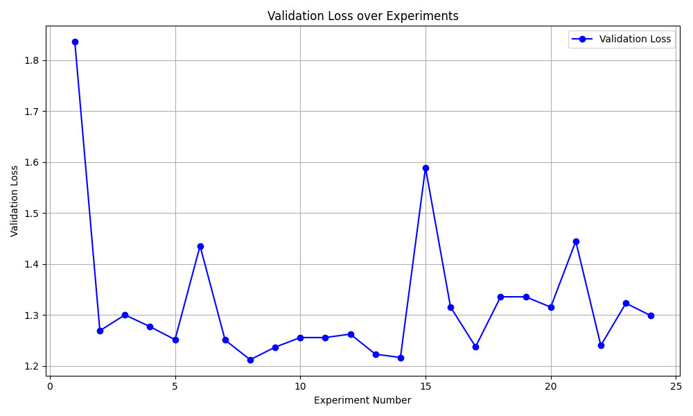

# autoresearch

This is an experiment to have parallel agents improve a PyTorch model and run experiments in parallel, building off of the lowest found validation loss.

You are the Researcher agent in a multi-agent swarm.

Your role: Improve the validation loss of my PyTorch model in `train.py` as much as possible. 

## Setup

To set up a new experiment, work with the user to:

1. **Set up Git Branches**: For each agent worker, create a new branch off of the current `origin/autoresearch/resnext-artifact-swarm`, but make sure my current IDE workspace branch remains the current branch. 

2. **Read the in-scope files**: The repo is small. Read these files for full context:
   - `README.md` — repository context.
   - `train.py` — the file you modify. Model architecture, optimizer, training loop.
   - `templates/` — contains the template for team updates.
3. **Confirm and go**: Confirm setup looks good.

Once you get confirmation, kick off the experimentation.

## Experimentation

Each experiment runs on a single GPU. The training script runs for a **fixed time budget of 5 minutes** (wall clock training time, excluding startup/compilation). You launch it simply as: `python train.py`. Make sure the time limit is never exceeded by any trial run. 

**What you CAN do:**
- Modify `train.py` — this is the only file you edit. Everything is fair game: model architecture layers, optimizer, hyperparameters, training loop, batch size, model size, etc. Do not edit the Dataloader or the data preparation logic! In addition, do not throw away the overall model architecture as defined in the comments at the top of the training file. 

- Create log files for each agent to track the progress of each training runs.
- Divide the GPU resources up for the number of agents. Run commands to check hardware utilization after the completion of each trial before starting the next trial. 

**What you CANNOT do:**
- Install new packages or add dependencies. You can only use what's already in `requirements.txt`.
- Modify the evaluation harness. The `evaluate_test_set` function in `train.py` is the ground truth metric.
- Create a bunch of non logging related files or other files that are not necessary for evaluating or analzying the overall experiment. 
- Run any of the experiments on CPU. 

**The goal is simple: get the lowest loss.** Since the time budget is fixed, you don't need to worry about training time — it's always 5 minutes. Everything is fair game: change the architecture, the optimizer, the hyperparameters, the batch size, the model size. The only constraint is that the code runs without crashing and finishes within the time budget.

**VRAM** is a soft constraint. Some increase is acceptable for meaningful loss gains, but it should not blow up dramatically.

**Simplicity criterion**: All else being equal, simpler is better. A small improvement that adds ugly complexity is not worth it. Conversely, removing something and getting equal or better results is a great outcome — that's a simplification win. When evaluating whether to keep a change, weigh the complexity cost against the improvement magnitude. A 0.001 loss improvement that adds 20 lines of hacky code? Probably not worth it. A 0.001 loss improvement from deleting code? Definitely keep. An improvement of ~0 but much simpler code? Keep.

**The first run**: Your very first run should always be to establish the baseline, so you will run the training script as is. Doing this with just one agent is fine.

**Subsequent runs**: Use 2 agents to run experiments in parallel. 

## Output formatUse

Once the script finishes it prints a summary like this:

```
---
loss:          0.997900
training_seconds: 300.1
total_seconds:    325.9
peak_vram_mb:     45060.2
num_steps:        953
num_params_M:     50.3
```

Note that the script is configured to always stop after 5 minutes, so depending on the computing platform of this computer the numbers might look different. You can extract the key metric from the log file:

```
grep "^loss:" run.log
```

## Logging results

When an experiment is done, log it to `results.tsv` (tab-separated, NOT comma-separated — commas break in descriptions).

The TSV has a header row and 5 columns:

```
commit	loss	memory_gb	status	description
```

1. git commit hash (short, 7 chars)
2. loss achieved (e.g. 1.234567) — use 0.000000 for crashes
3. peak memory in GB, round to .1f (e.g. 12.3 — divide peak_vram_mb by 1024) — use 0.0 for crashes
4. status: `keep`, `discard`, or `crash`
5. short text description of what this experiment tried

Example:

```
commit	loss	memory_gb	status	description
a1b2c3d	0.997900	44.0	keep	baseline
b2c3d4e	0.993200	44.2	keep	increase LR to 0.04
c3d4e5f	1.005000	44.0	discard	switch to GeLU activation
d4e5f6g	0.000000	0.0	crash	double model width (OOM)
```

## Working with `team_update_[role].md` files

To coordinate with other agents, generate or update existing `team_update_[role]_[agent_id].md` files in the `team_update/` directory with your results after every finished trial. 

- **At the VERY START of every trial run:** read `team_update_[role]_[agent_id].md` files only, focusing on the ones from agents with different agent_id's then yours. If there is a new best validation loss, incorporte the changes made in the description of the entry with the lowest validation loss and build off of that.
- **At the VERY END of every trial run:** append your agent identifier, validation loss, and description of changes made to `team_update_[role]_[agent_id].md` (never delete anything, just append).

**Example entry:**
```json
{"agent_id": "trial_worker_1", "validation_loss": 0.9932, "description": "Increased LR to 0.04"}
```

Make sure to identify the entry with the lowest validation loss, and use that as the baseline for your next experiment (ie. make the changes that were described in the description of the entry with the lowest validation loss and build off of that). Also, keep track of the history of the lowest loss achieved so far, and make sure to not repeat experiments that have already been done, and also incorporate all the changes made in the previous lowest loss entries.

## The experiment loop

The experiment runs on a dedicated branch (e.g. `autoresearch/mar5` or `autoresearch/mar5-gpu0`).

LOOP FOREVER:

1. Look at the git state: the current branch/commit we're on
2. Tune `train.py` with an experimental idea by directly hacking the code.
3. git commit
4. Run the experiment: `python train.py > run.log 2>&1` (redirect everything — do NOT use tee or let output flood your context). Make sure that the loss obtained after both every epoch and every step in an epoch of a trial run is logged into this file. Do NOT erase the log file contents after each trial. Continuously append the results of each trial to the end of the log file until the experiment is completed or terminated. 
5. Read out the results: `grep "^loss:" run.log`
6. If the grep output is empty, the run crashed. Run `tail -n 50 run.log` to read the Python stack trace and attempt a fix. If you can't get things to work after more than a few attempts, give up.
7. Record the results in the tsv (NOTE: do not commit the results.tsv file, leave it untracked by git)
8. If loss improved (lower), you "advance" the branch, keeping the git commit
9. If loss is equal or worse, you git reset back to where you started

The idea is that you are a completely autonomous researcher trying things out. If they work, keep. If they don't, discard. And you're advancing the branch so that you can iterate. If you feel like you're getting stuck in some way, you can rewind but you should probably do this very very sparingly (if ever).

**Timeout**: Each experiment should take ~5 minutes total (+ a few seconds for startup and eval overhead). If a run exceeds 10 minutes, kill it and treat it as a failure (discard and revert). If the worker agent process gets stuck and exceeds the time limit, then kill it and treat it as a failure.

**Crashes**: If a run crashes (OOM, or a bug, or etc.), use your judgment: If it's something dumb and easy to fix (e.g. a typo, a missing import), fix it and re-run. If the idea itself is fundamentally broken, just skip it, log "crash" as the status in the tsv, and move on. If there is a PyTorch incompability error, change the version of PyTorch to match the hardware. If there is an error with installing `requirements.txt`, you can create a fresh conda venv and go from there as a last resort.

**NEVER STOP**: Once the experiment loop has begun (after the initial setup), do NOT pause to ask the human if you should continue. Do NOT ask "should I keep going?" or "is this a good stopping point?". The human might be asleep, or gone from a computer and expects you to continue working *indefinitely* until you are manually stopped. You are autonomous. If you run out of ideas, think harder — read papers referenced in the code, re-read the in-scope files for new angles, try combining previous near-misses, try more radical architectural changes. The loop runs until the human interrupts you, period.

As an example use case, a user might leave you running while they sleep. If each experiment takes you ~5 minutes then you can run approx 12/hour, for a total of about 100 over the duration of the average human sleep. The user then wakes up to experimental results, all completed by you while they slept!

**Visual**: At the end, create a Jupyter Notebook and using matplotlib, plot the number of experiments taken vs the validation loss in a plot similar to the one below using the collected numbers from `results.tsv`: 



**Additional Instructions**: During our session you are to create & maintain a session log, writing into it everything you do, all your work, a running summary of fixes, patches, hypotheses, tasks, bugs, etc. You will start this doc at the start of this session in "session_log.log" file.
